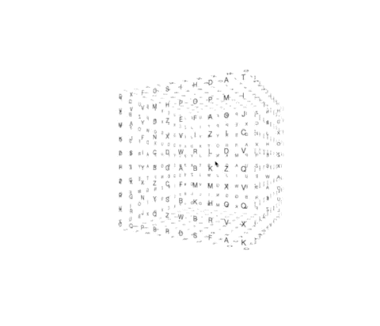
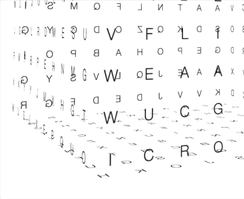

# ChronoGrid

**ChronoGrid** is a 3D interactive cube composed of dynamically changing letters. Letters animate like mechanical counters — rapidly shifting characters that gradually slow down and settle on a final letter, creating a dynamic and rhythmic visual countdown effect.

This project merges digital aesthetics with mechanical nostalgia, creating an endless loop of symbolic transformation.

---

## 🎥 Previews

### 🌀 Full Rotation

### 🔍 Close-Up

### 🔁 Countdown Letter Animation

---

## ✨ Features

- 3D rotatable cube (mouse and touch interaction)
- Letters flip and change over time, simulating split-flap displays
- Fully responsive design
- Built with pure HTML, CSS, and JavaScript

---

## 🧠 Artistic Inspiration

> This project is conceptually inspired by the work *Między* by Polish concrete poet and artist **Stanisław Dróżdż**.  
> In his 1977/2004 installation, Dróżdż explored the spatial and semantic dimension of language, focusing not on what is written, but on what lies **between** — _między_.  
> Similarly, **ChronoGrid** seeks to create a dynamic visual space where letters appear, shift, and float — forming not static words, but symbolic movement and tension in space and time.

---

## 🔧 Technologies

- HTML5  
- CSS3 with 3D transforms  
- JavaScript (vanilla)

---

## 🚀 Getting Started

To run ChronoGrid locally:

1. Clone the repository: git clone https://github.com/yourusername/chronogrid.git

2. Navigate into the project directory: cd chronogrid

3. Open cube.html in your browser — no build or server required.
   
